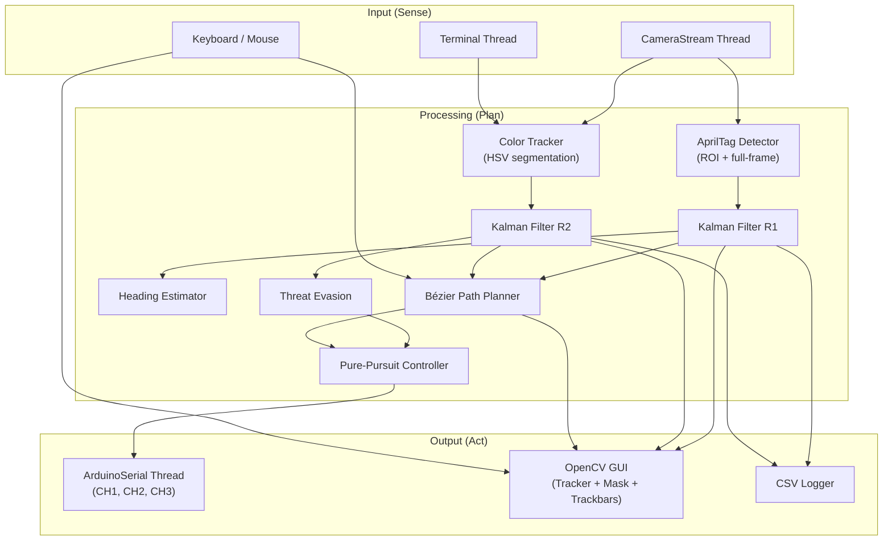
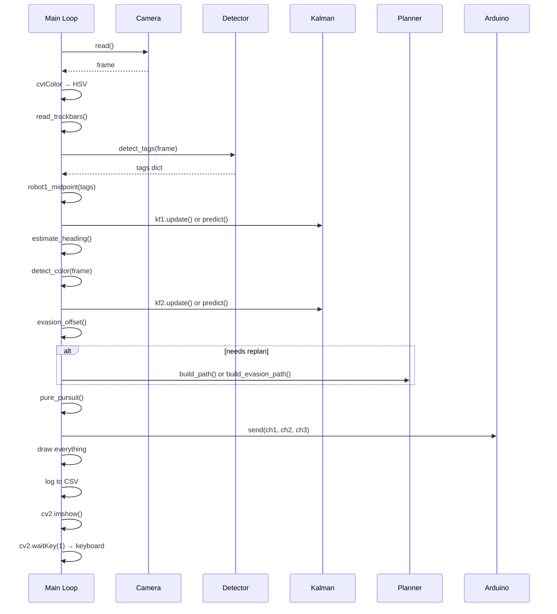

# Software Design Document — Combat Robot Controller

## 1. Architecture Overview

The system is currently implemented as a **single monolithic Python script** (`robot_brain.py`, 1286 lines) that evolved from a tracking-only prototype (`unified_tracking.py`, 793 lines). It follows a **sense-plan-act** pipeline executed in a synchronous main loop, with threaded I/O for camera capture and serial output.



---

## 2. Threading Model

| Thread | Purpose | Daemon | Rate |
|--------|---------|--------|------|
| **Main** | Sense-plan-act loop, OpenCV GUI | No | ~30–60 Hz (camera-bound) |
| **CameraStream._grab** | Continuously reads frames from V4L2, stores latest | Yes | Camera FPS |
| **ArduinoSerial._sender** | Pops latest command from queue, writes to serial | Yes | ~50 Hz |
| **terminal_loop** | Reads stdin for save/load/info/quit commands | Yes | Blocking on input |

> [!WARNING]
> The main thread does all vision processing, path planning, control computation, drawing, and GUI updates in a single synchronous iteration. Heavy operations (full-frame AprilTag scan, `solvePnP` per tag) can cause frame drops.

---

## 3. Component Design

### 3.1 CameraStream

**Responsibility**: Decouple USB frame delivery from the main loop to prevent stalls.

| Attribute | Detail |
|-----------|--------|
| Pattern | Producer thread with latest-frame buffer (size 1) |
| Codec | MJPEG (required for 720p60 on Logitech C920) |
| Buffer | Single-frame, protected by `threading.Lock` |
| Failure | 5-second startup timeout with `RuntimeError` |
| Exposure | Configurable: auto (V4L2 mode 3) or manual (mode 1 + value) |

### 3.2 KalmanTracker

**Responsibility**: Smooth noisy position measurements and predict through occlusions.

| Attribute | Detail |
|-----------|--------|
| State vector | `[x, y, vx, vy, ax, ay]` (6-state, 2-measurement) |
| Transition | Constant-acceleration model with variable `dt` |
| Coast limit | 30 frames before returning `None` |
| Instances | `kf1` (R1, lower noise), `kf2` (R2, higher noise) |

```
update(x, y, dt):            correct → predict → reset coast
predict(dt):                  predict only → increment coast
velocity() → (vx, vy):       read state[2:4]
position_float() → (x, y):   read state[0:2]
```

### 3.3 AprilTag Detection (Robot 1)

**Responsibility**: Locate R1's two tags and compute the robot midpoint.

**Two-pass strategy**:
1. **ROI Pass**: Crop the frame around each tag's last known bounding box (±150 px padding). Runs the detector on a smaller image for speed.
2. **Full-Frame Pass**: Falls back to scanning the entire grayscale frame when tags are missing or uninitialized.

**Midpoint logic** (`robot1_midpoint`):
- Both tags visible → geometric midpoint; learn rotation-aware offsets.
- One tag visible → apply learned offset (rotated by current tag yaw delta).
- No tags → return `None`; Kalman coasts or color fallback engages.

### 3.4 Color Tracking (Robot 2)

**Responsibility**: Detect R2's position via HSV color segmentation.

| Step | Operation |
|------|-----------|
| 1 | `cvtColor(BGR → HSV)` |
| 2 | `inRange` with hue wrap-around handling |
| 3 | Morphological open (5×5 kernel) to remove noise |
| 4 | Morphological dilate (5×5) to fill gaps |
| 5 | `findContours` → largest contour by area |
| 6 | Reject if area < `MIN_CONTOUR_AREA` (500 px²) |
| 7 | Centroid from `moments` |

### 3.5 Robot1ColorTracker (Fallback)

**Responsibility**: Color-based fallback when both AprilTags on R1 are lost.

- Re-samples HSV at R1's Kalman-estimated position every 60 frames.
- Persists profile to `robot1_color.json`.
- Uses same contour-based detection pipeline as R2 (without dilate step).

### 3.6 Heading Estimator

**Responsibility**: Determine R1's forward direction.

Priority cascade:
1. **Tag poses**: Average forward vectors from visible R1 tags via `solvePnP` → rotation matrix → `atan2(R[0,1], R[1,1])`.
2. **Velocity vector**: If Kalman velocity magnitude > 0.5 px/frame, use velocity heading.
3. **Default**: 0° (east).

### 3.7 Bézier Path Planner

**Responsibility**: Generate a smooth approach trajectory for the knock-through maneuver.

**Geometry**:
```
push_unit  = normalize(target_tag − R2)        # direction R2 must travel
entry_pt   = R2 − push_unit × STANDOFF         # lineup point behind R2
Bézier     = cubic(R1, C1, C2, entry_pt)       # 55-sample curve
Straight   = linspace(entry_pt, R2, 10)         # drive-through segment
Path       = concat(Bézier, Straight)
```

- **C1** departs R1 along its current heading (max 220 px lever arm).
- **C2** arrives at `entry_pt` from the push direction (max 180 px lever arm).
- All control points are clamped to arena safe zone.

**Evasion path**: Simpler single-segment Bézier from R1 to the perpendicular dodge point.

### 3.8 Pure-Pursuit Controller

**Responsibility**: Convert path + heading into drive/steer PWM values.

| Parameter | Value |
|-----------|-------|
| Lookahead distance | 80 px |
| Max drive speed | ±400 µs from neutral (1100–1900 range) |
| Max turn speed | ±400 µs from neutral |
| Dead zone | < 5 px from lookahead → neutral |

```
heading_error = target_angle − current_heading  (wrapped to ±180°)
steer = 1500 + clamp(error / 180 × MAX_TURN, ±MAX_TURN)
speed_factor = max(0.2, 1.0 − |error| / 120)
drive = 1500 + clamp(MAX_DRIVE × speed_factor, ±MAX_DRIVE)
```

### 3.9 Threat Evasion

**Responsibility**: Detect R2 charging at R1 and compute a dodge waypoint.

- Triggers when R2's speed > 1.5 px/frame AND velocity-to-R1 angle < `THREAT_CONE_DEG` (40°).
- Dodge point: R1 + perpendicular to R2's velocity × `EVASION_OFFSET` (120 px), clamped to arena.
- Evasion path is followed instead of the attack path; weapon is disarmed.

### 3.10 ArduinoSerial

**Responsibility**: Non-blocking serial writer to the Arduino Nano.

| Attribute | Detail |
|-----------|--------|
| Queue | `deque(maxlen=1)` — only latest command retained |
| Format | `"CH1,CH2,CH3\n"` (values clamped to 1000–2000) |
| Rate | Sender thread sleeps 20 ms between writes (~50 Hz) |
| Auto-detect | Scans `serial.tools.list_ports` for USB/ACM/COM ports |
| Shutdown | Sends neutral, waits 150 ms, closes port |

### 3.11 ArenaBounds

**Responsibility**: Define the playable area and enforce safe positioning.

- Raw bounds: `(50, 50)` to `(1230, 670)` — hard-coded pixel coordinates.
- Safe zone: Raw bounds inset by `ROBOT_OFFSET` (default 40 px, adjustable at runtime).
- `clamp(pt)`: Force a point into the safe zone.
- `inside(pt)`: Test if a point is in the safe zone.

---

## 4. State Management

**Global mutable state** is used extensively:

| Variable | Scope | Purpose |
|----------|-------|---------|
| `kf1`, `kf2` | Module-level | Kalman filter instances |
| `arena` | Module-level | Arena bounds instance |
| `hsv_lower`, `hsv_upper` | Module-level | R2 color range |
| `picked_hsv` | Module-level | Last clicked HSV value |
| `tolerance_r2` | Module-level | R2 HSV tolerance dict |
| `current_hsv_frame` | Module-level | Latest HSV frame (shared with mouse callback) |
| `running` | Module-level | Shutdown flag |
| `_roi`, `_roi_miss` | Module-level | Per-tag ROI tracking state |
| `_tag_offset` | Module-level | Learned tag-to-midpoint offsets |
| `_mid_source` | Module-level | Debug string for R1 source |
| `_cam_ref` | Module-level | Camera reference for exposure trackbar |

> [!CAUTION]
> Heavy reliance on mutable module-level globals creates tight coupling between all components and makes the system difficult to test, extend, or run multiple instances of.

---

## 5. Control Loop Sequence (per frame)



---

## 6. File Layout (Current)

```
tracking/
├── Control/
│   └── robot_brain.py          # 1286 lines — the full application
├── unified_tracking.py          # 793 lines — predecessor (tracking only)
├── color_track.py               # 86 lines — camera calibration utility
├── tagTest.py                   # 147 lines — AprilTag pose estimation test
└── apriltag/                    # Native apriltag library (C extension)
```

> [!IMPORTANT]
> `robot_brain.py` duplicates ~60% of the code from `unified_tracking.py` rather than importing from it. The two files have diverged and maintaining both is error-prone.
