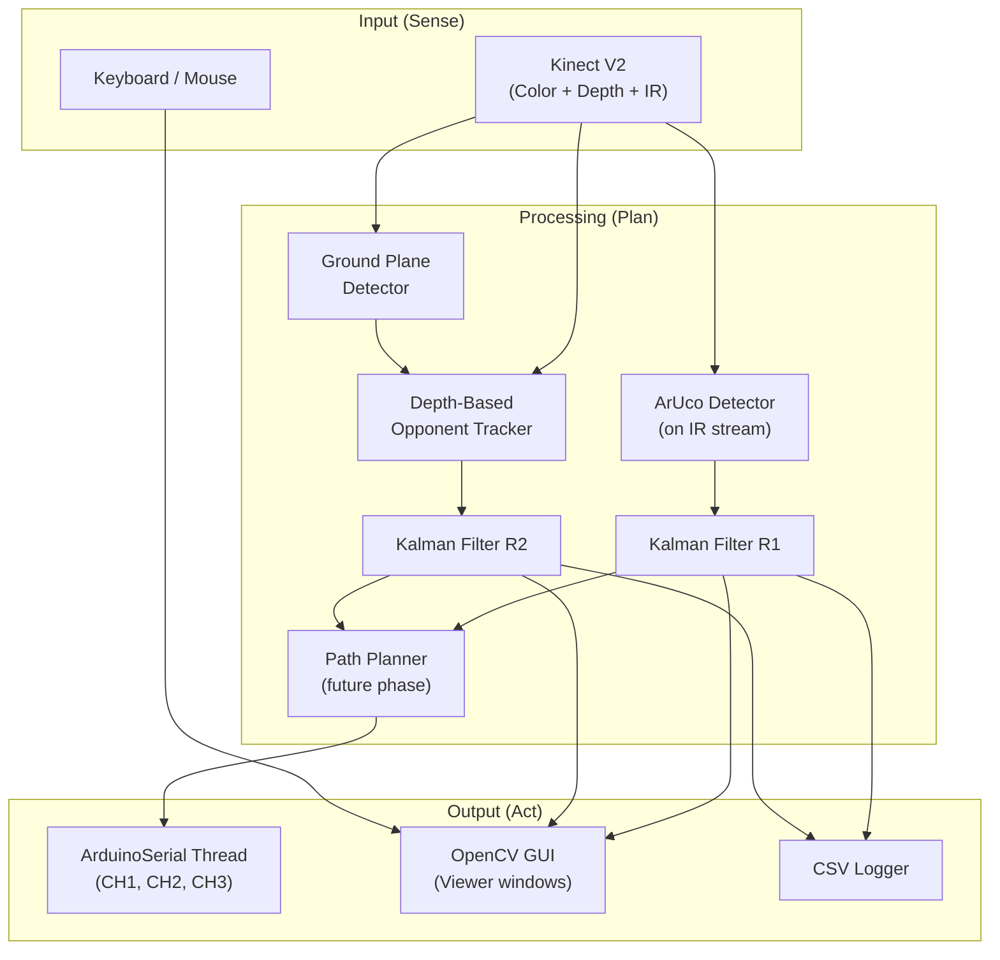

# Software Design Document — Combat Robot Controller

## 1. Architecture Overview

The system is being rewritten to use a **Kinect V2** as the sole vision sensor, replacing the previous USB webcam + AprilTag + HSV color tracking approach. The control subsystem (Arduino serial, PPM output) is unchanged.

The architecture follows a **sense → plan → act** pipeline:



---

## 2. Vision Subsystem (Kinect V2)

### 2.1 Sensor Characteristics

The Kinect V2 provides three synchronised data streams:

| Stream | Resolution | FPS | Format | Use |
|--------|-----------|-----|--------|-----|
| Color | 1920×1080 | 30 | BGRX uint8 | Visual display, optional tag detection |
| Depth | 512×424 | 30 | float32 (mm) | Opponent detection, ground plane |
| IR | 512×424 | 30 | float32 | ArUco tag detection |

> [!IMPORTANT]
> The IR and depth sensors share the same optical axis and resolution (512×424), so pixel coordinates correspond directly between them. The color camera has a different field of view and requires registration to align with depth.

### 2.2 Camera Mounting

The Kinect is mounted on the **side of the arena** looking inward at an angle. This differs from the previous overhead webcam:

- Objects appear at perspective angles, not top-down
- Ground plane must be detected/calibrated to identify the arena floor
- Depth varies across the image based on geometry and angle
- Registration (color-to-depth mapping) is important for visual overlays

### 2.3 KinectStream

**Responsibility**: Threaded frame acquisition from the Kinect V2 via `pylibfreenect2`.

| Attribute | Detail |
|-----------|--------|
| Pattern | Capture thread with latest-frame buffers (one per stream) |
| Backend | Configurable: OpenGL (fastest), OpenCL, or CPU |
| Streams | Color, Depth, IR, Registered (color-mapped-to-depth) |
| Startup | 10-second timeout with `RuntimeError` on failure |
| Thread safety | All frame reads return copies, protected by `threading.Lock` |

**API**:
```python
class KinectStream:
    def start() -> None
    def stop() -> None
    def read_color() -> Optional[np.ndarray]       # (1080, 1920, 3) uint8 BGR
    def read_depth() -> Optional[np.ndarray]       # (424, 512) float32 mm
    def read_ir() -> Optional[np.ndarray]          # (424, 512) float32
    def read_registered() -> Optional[np.ndarray]  # (424, 512, 3) uint8 BGR
    def ir_camera_params -> IrCameraParams         # Intrinsics for pose estimation
```

---

## 3. Robot Detection (ArUco on IR)

### 3.1 Why IR for Tag Detection

The Kinect V2 IR sensor operates independently of ambient lighting conditions:

- Unaffected by arena spotlights, strobes, or shadows
- The Kinect's active IR illuminator provides consistent lighting
- Matte-printed ArUco tags on paper have good contrast in IR
- Same coordinate space as depth (no registration needed)

### 3.2 ArUco Tag Configuration

| Tag | ID | Location | Purpose |
|-----|----|----------|---------|
| Top | 0 | Top face of robot | Normal tracking |
| Bottom | 1 | Bottom face of robot | Upside-down tracking |

**Orientation detection**: When tag 0 (top) is visible, the robot is right-side up. When tag 1 (bottom) is visible, the robot is inverted. The system adjusts its heading and control calculations accordingly.

**Dictionary**: `DICT_4X4_50` — 4×4 bit patterns with 50 unique markers. Chosen for:
- Small grid size → detectable at lower resolutions (512×424 IR)
- Sufficient markers for robot + future arena markers
- Good error correction for motion blur

### 3.3 Detection Pipeline (planned)

```
IR Frame (512×424 float32)
  ↓ Normalise to uint8
  ↓ cv2.aruco.detectMarkers()
  ↓ Filter for robot tag IDs {0, 1}
  ↓ cv2.aruco.estimatePoseSingleMarkers() for pose
  ↓ Robot centre = tag centre + known offset
  ↓ Robot heading = from tag rotation
  ↓ Robot orientation = top_tag_visible ? upright : inverted
```

---

## 4. Opponent Detection (Depth-Based)

### 4.1 Concept

Instead of HSV colour tracking (fragile under varying lighting), the new system uses depth data to find the opponent:

1. **Detect the ground plane** — fit a plane to the arena floor in the depth image
2. **Subtract the ground** — find all pixels significantly above the ground plane
3. **Mask out our robot** — exclude the region around the detected ArUco tag position
4. **Remaining above-ground pixels = opponent**

### 4.2 Ground Plane Detection (planned)

Since the camera is mounted at an angle (not overhead), the ground plane appears as a tilted surface in the depth image. Approach:

1. Collect depth samples from known empty arena regions (calibration step)
2. Fit a plane equation `ax + by + c = z` using RANSAC or least squares
3. For each pixel, compute expected ground depth and compare with actual depth
4. Pixels where `actual_depth < expected_depth - threshold` are "above ground"

### 4.3 Opponent Localisation (planned)

```
Depth Frame (512×424 float32 mm)
  ↓ Apply ground plane model
  ↓ Threshold: pixels > N mm above ground
  ↓ Mask out robot position (from ArUco detection)
  ↓ Contour detection on remaining mask
  ↓ Largest contour centroid = opponent position
  ↓ Depth at centroid = opponent distance
```

---

## 5. Control Subsystem (Unchanged)

### 5.1 ArduinoSerial

Same as previous design — non-blocking serial writer using single-character protocol.

| Attribute | Detail |
|-----------|--------|
| Protocol | Single-character commands (`w/s/a/d/x/z/c/space`) |
| Baud | 9600 |
| Queue | `deque(maxlen=1)` — only latest command retained |
| Rate | Sender thread sleeps 20 ms between writes (~50 Hz) |

### 5.2 KalmanTracker

Same 6-state Kalman filter (`x, y, vx, vy, ax, ay`), but now operating in depth-frame pixel coordinates (512×424) rather than webcam coordinates (1280×720).

### 5.3 ArenaBounds

Arena bounds now defined in depth-frame pixel coordinates. Default values updated for the 512×424 depth resolution.

---

## 6. Threading Model

| Thread | Purpose | Daemon | Rate |
|--------|---------|--------|------|
| **Main** | Control loop, OpenCV GUI | No | ~30 Hz (Kinect-bound) |
| **KinectStream._capture_loop** | Reads frames via pylibfreenect2, stores latest | Yes | ~30 Hz |
| **ArduinoSerial._sender** | Pops latest command from queue, writes to serial | Yes | ~50 Hz |

---

## 7. File Layout

```
Control/
├── config.yaml                  # Tunable parameters
├── requirements.txt             # Python dependencies
├── install_kinect.sh            # libfreenect2 + pylibfreenect2 installer
├── install.sh                   # Legacy installer (may be removed)
├── arduino_trainer/             # Arduino firmware
├── robot_control/
│   ├── __init__.py              # Package init
│   ├── __main__.py              # Entry point (WIP)
│   ├── config.py                # YAML config loader
│   ├── serial_output.py         # Arduino serial output
│   ├── filters.py               # Kalman tracker
│   ├── arena.py                 # Arena bounds
│   ├── watchdog.py              # Safety watchdogs
│   ├── state.py                 # Runtime state
│   ├── log.py                   # CSV logger
│   ├── profile.py               # Profile persistence
│   └── vision/
│       ├── __init__.py          # Vision subpackage
│       ├── kinect_stream.py     # Kinect V2 frame acquisition
│       └── kinect_viewer.py     # Diagnostic stream viewer
├── tests/                       # Unit tests
└── docs/
    ├── design/design.md         # This document
    └── reqs/requirements.md     # Software requirements
```
